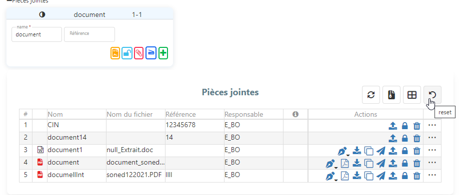
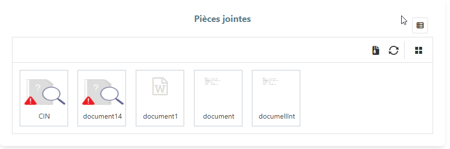

## COMPSANT D'ATTACHEMENT

# Version 1.1.1

dependency :
"ngx-clipboard": "^15.1.0",
"ngx-device-detector": "^4.0.1",
"ngx-doc-viewer": "^1.4.1",

dans env.js

    pstoolkitURLhttps : 
    cloudMsiPSTK : 
    pstkport :

Input

    @Input('objectData') objectData/*Model of Get by ID de l'objet Metier */
    @Input('URL') URL;  /*Url de lobjet de GET by id  */
    @Input() classid: any; 
    @Input() objectid: any;
    @Input() isPublic: Boolean ;/* True si l'objet metier n'a pas de securité, permission etc..   */

Output

    @Output() refreshedReqFileDef = new EventEmitter<any>(); /*Refresh Request file defnition */

Exemple d'appel :  

       <app-attachment
        [classid]="classid"
        [objectid]="objectid"
        [objectData]="courrierByIdDtoModel"
        (refreshedReqFileDef)="getById()"
        [URL]="'/tesst'"
        ></app-attachment>
______________________________________________________________________________________

# Version 1.1.2
    dependency :
  
    "angular2-text-mask": "9.0.0",

Input

    @Input('objectData') objectData/*Model of Get by ID de l'objet Metier */
    @Input('URL') URL;  /*Url de lobjet de GET by id  */
    @Input() classid: any; 
    @Input() objectid: any;
    @Input() isPublic: Boolean ;/* True si l'objet metier n'a pas de securité, permission etc..   */
   

    /*Monitoring Datagrid actions*/
    @Input() canDeleteDatagrid: Boolean = true
    @Input() canlockDatagrid: Boolean = true
    @Input() canUploadfileDatagrid: Boolean = true
    @Input() canTransfertDatagrid: Boolean = true
    @Input() canActionPDFDatagrid: Boolean = true
    @Input() canCloneDatagrid: Boolean = true
    @Input() canDonwloadfileDatagrid: Boolean = true
    @Input() canModiffileDatagrid: Boolean = true
    @Input() canShowfileDatagrid: Boolean = true
    /*Monitoring Datagrid actions*/
    @Input() ReadOnly: Boolean = false;

    /*Visible column in data grid */
    @Input() visibleCellIndex: Boolean = true
    @Input() visibleCellId: Boolean = false
    @Input() visibleCellFileType: Boolean = true
    @Input() visibleCelldocTitle: Boolean = true
    @Input() visibleCellfileName: Boolean = true
    @Input() visibleCelldocId: Boolean = true
    @Input() visibleCelldocIssueDate: Boolean = false
    @Input() visibleCelldocExpirationDate: Boolean = false
    @Input() visibleCellissueAdress: Boolean = false
    @Input() visibleCelldocSize: Boolean = true
    @Input() visibleCellsysdateUpdated: Boolean = true
    @Input() visibleCellResponsable : Boolean = true
    @Input() visibleCellsecuriteLevel : Boolean = true
    @Input() visibleCellSignedOrLockedState : Boolean = true
    /*Visible column in data grid */
    @Input() ModeGridVsThumbnail: boolean = false;/*true === cad thumbnail // false === cad grid */

Output

    @Output() refreshedReqFileDef = new EventEmitter<any>(); /*Refresh Request file defnition */

Exemple d'appel :

       <app-attachment
        [classid]="classid"
        [objectid]="objectid"
        [objectData]="courrierByIdDtoModel"
        (refreshedReqFileDef)="getById()"
        [URL]="'/tesst'"
        ></app-attachment>
______________________________________________________________________________________

# Version 1.1.3 

ajouter qq adaptatoin selon l'integration dans Kernel
